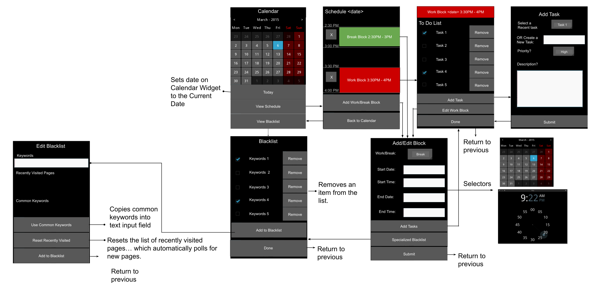

# NagBot
SD&amp;D project

**NagBot.py** - just testing out the GUI with Kivy, basic Calendar and ScreenManager. Be sure to install kivy ```conda install kivy``` and ```pip install pywin32``` for Windows pop up notifications.

**window_grabber.py** - used for grabbing the active window. Make sure to install the depedencies mentioned in the comments.

**database.py** - contains the class stucture for storing all info necessary to operate the NagBot app

**alerts.py** - contains the alert system which will notify the user when they are entering/exiting a block and "nag" them if they go off task (vist a blacklisted site during a Work Block)

UI Flowchart (UI may differ a bit since we are still in beta)
